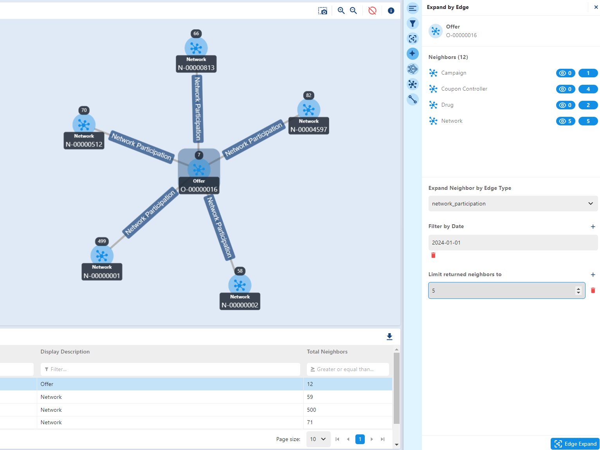

# Expand By Connection

Similarly to the functionality of [Expand By Object](basicPlus.md#expand-by-object), there is a tool that allows for users to find expand by finding currently active connections. This feature is found in the `Expand By Connection` tool (marked with a four-pointed star). Here, this user is able to find the current "active" connection, meaning that for a given date that the user provides, this expands where for both the initial nodes and neighbor nodes, all the records have the input date between a "Record Active Date" and "Record Expiration Date". Note that the form of  `Expand By Connection` requests the user to select the type of connection instead of the neighbor and instead of searching based on a given attribute, this only has an input box for the user to search for in the format of YYYY-MM-DD. Once the user has inputted their desired date, they can simply press `Edge Expand` and the results will provide search result based on the "active" edge attributes.

