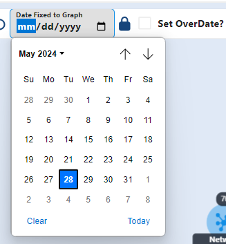
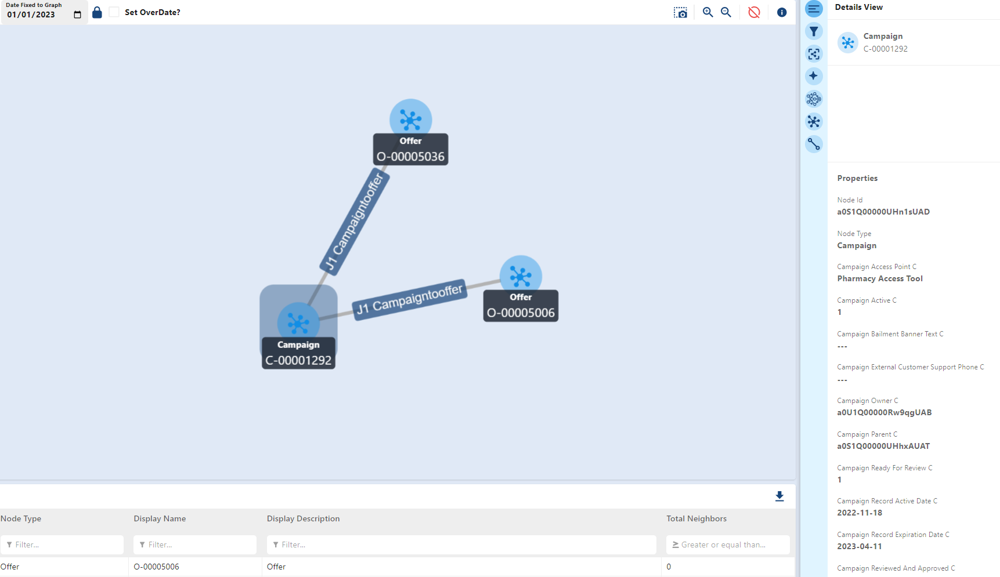

# OverDate Sub Graph

The Graph-Explorer includes a unique features that are not present within the base model which can be useful for the user to filter

## OverDate Subgraph

Within the graph-explorer, the user can specify a given date on the top of the toolbar where they cam filter all items on the `canvas` which are active for the given date. Once the user has enough items that they want to analyze on the screem, the user can specify a given date to filter the `canvas` on `Date Fixed to Graph` form. This drops down a calendar from which the user can select a date.

Once the user specified their desired date, they can press the "Lock" icon which filters for every node and edge connection that is "Active" (date between `Record Expiration Date` and `Record Active Date`) which is a `subgraph` of the `canvas`.

